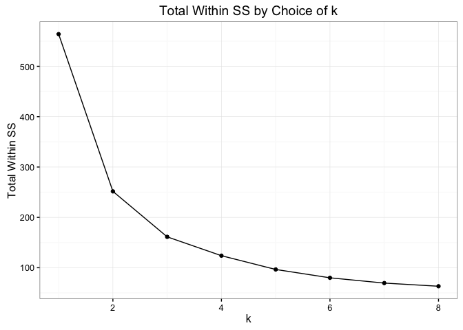
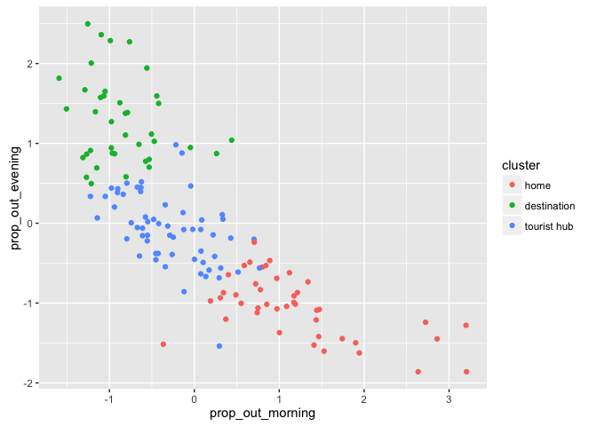
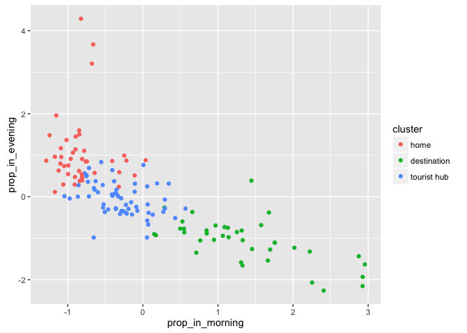
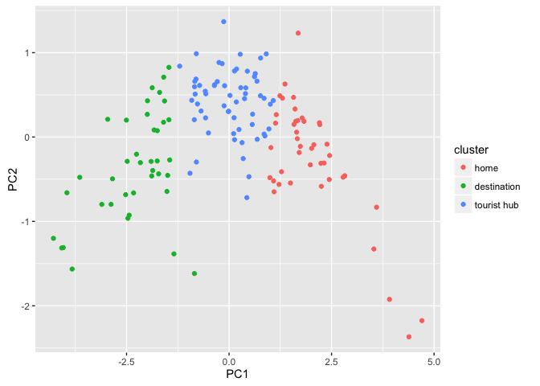
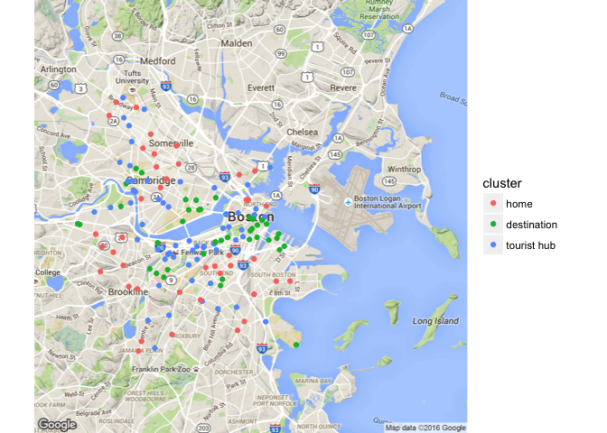
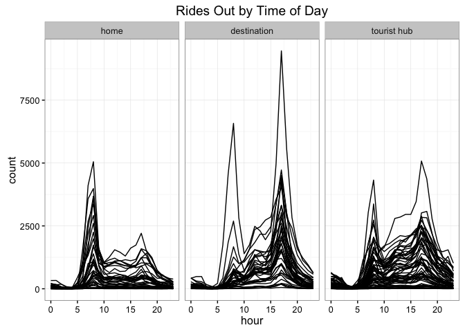
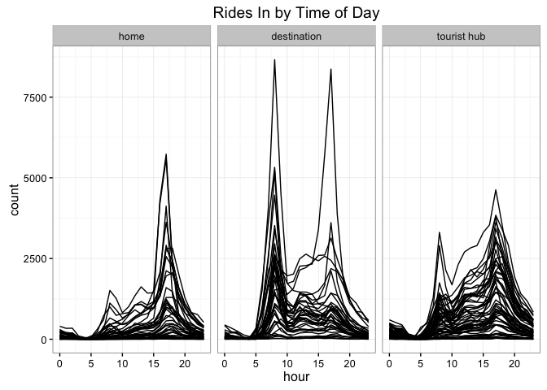

# clustering
Will Jones  
April 24, 2016  

Our goal here is to find appropriate ways to cluster the stations by their
patterns bikes in and bikes out through the day. 


```r
load("stations.RData")
stations$id = as.factor(stations$id)
trips <- fread("data/hubway_trips.csv", header = T, sep = ',')
```

```
## 
Read 54.5% of 1579025 rows
Read 1579025 rows and 13 (of 13) columns from 0.146 GB file in 00:00:03
```

```r
trips <- trips %>%
  mutate(status = factor(status),
         start_date = mdy_hms(start_date),
         end_date = mdy_hms(end_date),
         bike_nr = factor(bike_nr),
         subsc_type = factor(subsc_type),
         gender = factor(gender),
         zip_code = factor(zip_code),
         strt_statn = factor(strt_statn),
         end_statn = factor(end_statn)) %>%
  filter(!is.na(strt_statn) &
           !is.na(end_statn) & 
           duration > 0)

# Create a start time of day variable
trips <- mutate(trips, start_time = start_date)
day(trips$start_time) <- 1
month(trips$start_time) <- 1
year(trips$start_time) <- 2015
trips <- trips %>%
  mutate(start_time = as.numeric(start_time),
         start_time = start_time - min(start_time),
         start_time = start_time / 3600) # convert time from seconds to hours

# Create an end time of day variable
trips <- mutate(trips, end_time = end_date)
day(trips$end_time) <- 1
month(trips$end_time) <- 1
year(trips$end_time) <- 2015
trips <- trips %>%
  mutate(end_time = as.numeric(end_time),
         end_time = end_time - min(end_time),
         end_time = end_time / 3600) # convert time from seconds to hours
```


```r
trips %>% group_by(strt_statn) %>% summarise(count = n()) %>% arrange(desc(count))
```

```
## Source: local data table [142 x 2]
## 
##    strt_statn count
##        (fctr) (int)
## 1          22 56337
## 2          36 42481
## 3          53 35320
## 4          67 33547
## 5          16 32786
## 6          42 32763
## 7          33 31007
## 8          58 28213
## 9          52 26919
## 10         47 26762
## ..        ...   ...
```

Morning rush hour approx time: 7--10am
Evening rush hour approx time: 4--7pm

Features:

- proportion of bikes out during morning rush hour
- proportion of bikes in during morning rush hour
- proportion of bikes out during evening rush hour
- proportion of bikes in during evening rush hour
- variance in hourly rates

Add:

- average duration from / to station
- variance of ride duration
- proportion of rides that go from and to same station


## Choosing Features


```r
bike_out <- trips %>%
  group_by(strt_statn) %>%
  summarise(prop_out_morning = sum(between(start_time, 7, 10)) / n(),
            prop_out_evening = sum(between(start_time, 16, 19)) / n())

bike_in <- trips %>%
  group_by(end_statn) %>%
  summarise(prop_in_morning = sum(between(end_time, 7, 10)) / n(),
            prop_in_evening = sum(between(end_time, 16, 19)) / n())


# Merge features
stations_w_features <- left_join(stations, bike_out, by = c("id" = "strt_statn")) %>%
  left_join(bike_in, by = c("id" = "end_statn")) %>%
  # Scaling the features
  mutate(prop_out_morning = scale(prop_out_morning)[,1],
         prop_out_evening = scale(prop_out_evening)[,1],
         prop_in_morning = scale(prop_in_morning)[,1],
         prop_in_evening = scale(prop_in_evening)[,1])
```

## Clustering stations


```r
clustering_data <- select(stations_w_features, prop_out_morning, prop_out_evening,
                          prop_in_morning, prop_in_evening)

test_k <- function(k) kmeans(clustering_data,k, nstart = 40)$tot.withinss
ss <- sapply(1:8, test_k)

qplot(x = 1:8, y = ss) + geom_line() +
  labs(title = "Total Within SS by Choice of k",
       x = "k",
       y = "Total Within SS") + theme_bw()
```



```r
set.seed(42) # Needed to get consistent results
clustering <-  kmeans(clustering_data, centers = 3, nstart = 40)
pc <- prcomp(clustering_data)

stations_w_features$cluster <- as.factor(clustering$cluster)
stations_w_features <- cbind(stations_w_features, pc$x) %>% data.frame() %>% tbl_df()
```


```r
levels(stations_w_features$cluster) <- c("home", "destination", "tourist hub")

qplot(data = stations_w_features, x = prop_out_morning, y = prop_out_evening, color = cluster)
```



```r
qplot(data = stations_w_features, x = prop_in_morning, y = prop_in_evening, color = cluster)
```



```r
qplot(data = stations_w_features, x = PC1, y = PC2, color = cluster)
```



```r
qmap(location = "boston", zoom = 12) + 
  geom_point(aes(x = lng, y = lat, color = cluster), data = stations_w_features)
```

```
## Map from URL : http://maps.googleapis.com/maps/api/staticmap?center=boston&zoom=12&size=640x640&scale=2&maptype=terrain&language=en-EN&sensor=false
```

```
## Information from URL : http://maps.googleapis.com/maps/api/geocode/json?address=boston&sensor=false
```



```r
save(file="data/stations_clustered.RData", stations_w_features, compress = TRUE)
```


```r
example_distributions <- trips %>%
  #filter(strt_statn %in% example_stations) %>%
  mutate(hour = floor(start_time)) %>%
  group_by(strt_statn, hour) %>%
  summarise(count = n())

example_distributions <- left_join(mutate(example_distributions, id = strt_statn), select(stations_w_features, id, cluster), by ="id", copy = TRUE)

ggplot(example_distributions, aes(x = hour, y = count, group = id)) +
  geom_line() + 
  facet_wrap(~cluster) + 
  theme_bw() + 
  labs(title = "Rides Out by Time of Day")
```



```r
example_distributions <- trips %>%
  #filter(strt_statn %in% example_stations) %>%
  mutate(hour = floor(end_time)) %>%
  group_by(end_statn, hour) %>%
  summarise(count = n())

example_distributions <- left_join(mutate(example_distributions, id = end_statn), select(stations_w_features, id, cluster), by ="id", copy = TRUE)

ggplot(example_distributions, aes(x = hour, y = count, group = id)) +
  geom_line() + 
  facet_wrap(~cluster) + 
  theme_bw() + 
  labs(title = "Rides In by Time of Day")
```


