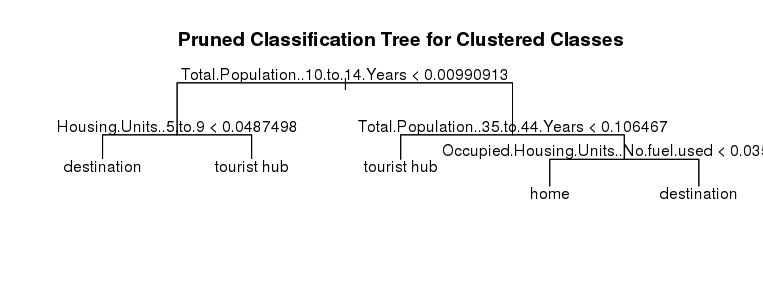
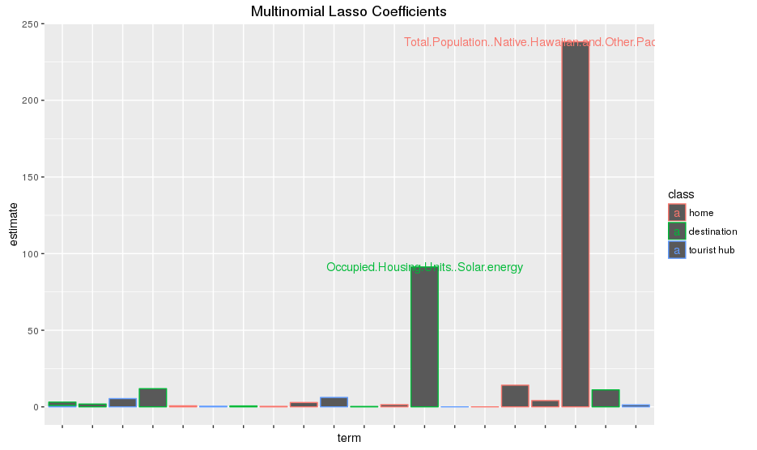

# Hubway Station Type Analysis
A project for Statistical Learning (Spring 2016) at Reed College by Will Jones, Alex Bracco, Evan Peairs and Taylor Holdaway.

###Abstract

City populations, in the U.S. and even more in developing nations, are growing. And as cities become more popular places to live and visit, better transportation network need to be developed. Bike share programs could be a hugely important feature of cities transportation systems, but successful systems will depend on being able to understand how cyclists use these systems.

In 2012 Hubway, in collaborating with the Metropolitan Area Planning Council (MAPC), created the Hubway Data Visualization Challenge to get submissions of innovative ways to visualize their data set of rides taken on their bikes. One of the winning submissions, “Hubway Bikes In / Bikes Out”, examines patterns in the the number of bikes going in and out of stations over time of day in weekdays, created by Kim Ducharme, Kenn Knowles, Zia Sobhani and Verena Tiefenbeck for the 2012 Hubway Data Challenge. (Their visualization can be found [here](http://zsobhani.github.io/hubway-team-viz/).) Their analysis showed that some stations showed strong patterns of commuter use—either having a spike in riders out in the morning and riders returning in the evening, or vice-versa—while others did not.

We build upon this analysis, in two steps: 

1. Identify features that allow us to identify these clusters (and possibly more types of relevant clusters) of stations;
2. Build a model that predicts which cluster a station will belong to based on demographic data of the census tracts nearest to the station. 

We identify three distinct types of stations based on rider patterns across time of day. However, we are unable to construct a predictive model with satisfactory misclassification rate using only demographic information.

##Introduction

Hubway is a bike rental service in the Boston metro area. Every time a rider checks a bike in or out from one of their terminals, data is collected on the user, time, location and bicycle identifier. This data can then be used to gain valuable insights about patterns in rental volume flow or user base. We seek to answer two questions. First, do stations fall into separate groups based on in- and out-flow of bicycles across time of day. Second, if stations are categorizable by recognizable patterns (e.g., commuter stations with high flow in or out in the morning and evening versus stations near tourist locations with lower use across all times of day), can these categories be predicted with demographic data for the surrounding area. This analysis could provide valuable insight for marketing or designing new stations with specific user group needs in mind.

To answer these questions, we first use k-means clustering based on flow-by-time-of-day features. Then, we fit an assortment of models (including parametric regularized and non-parametric tree-based models) to predict the clusters found by k-means. 

##The Data

The dataset is from a 2012 Hubway visualization challenge. It includes information on 1,579,025 trips taken by rental bikes in the Boston metropolitan area. There is also information on 142 stations in the Boston metro area. We combine this with US Census demographic data on this area, and geocoding information from Google Maps. Our unit of analysis is the stations, so we aggregated trip information during times of day categories by station.

To cluster based on flow across time of day, we created several features measuring this. Features constructed include proportion of bikes out during morning rush hour, proportion of bikes in during morning rush hour, proportion of bikes out during evening rush hour, proportion of bikes in during evening rush hour and the variance in hourly rates of flow.

##Exploratory Data Analysis

In order to perform clustering to look for types of stations, we first had to generate the ratio of riders in to riders out for each station. Since points in the Hubway dataset represent individual bike rentals, including the station and time at which the ride started and ended. We thus needed to aggregate this dataset by station, so that we could now chart the number of bikes entering and leaving each station at any given time of day. By averaging across every day included in the dataset, we were able to give an estimate of the number of bikes coming and going from the station on a normal day. We then binned these trips to and from the station based on whether they occurred during morning or evening rush hour. From observing the trends for a few stations, we determined the morning rush hour period to extend from 7:00 am to 10:00 am, and the evening rush hour from 4:00 pm to 7:00 pm. By using these periods as bins, we were able to produce a dataset of the proportion of bikes in and out during morning and evening rush hour for each station.

K-means clustering was performed on this dataset, with k set to 3 to account for our three hypothesized types of stations (home, tourist hub, destination). Based on the scree plot,
this seemed like a reasonable choice.

Looking at the clusters in the scatter plot below, the clusters seem to be on more of a spectrum. Though we could use PCA instead, which might represent this structure better, we chose to use clustering, as the discretize groups help make inference a bit easier. 

##Modeling

###A Lone Tree
We first fit a single classification tree, pruned with cost-complexity pruning, to predict the three classes we found in our clustering analysis. A classification tree is a very simple model, and may reveal certain characteristics of the relation between the cluster classes and the demographic data. However, this model will almost certainly predict very poorly.

The advantage of this pruned tree is that it is very easily interpretable. We see immediately from the diagrammed tree that the most important variable here is the share of population in the census tract between the ages of 10 and 14 years. This makes intuitive sense, as one might imagine that more popular tourist or work destinations are less residential, and so have fewer children living there.

We calculate the training misclassification rate to be 0.2877698, and the 10-fold cross-validation misclassification rate to be 0.5461538. This high cross-validation misclassification rate would indicate that the model does not generalize well to out-of-dataset observations. This is likely because of overfitting of the model to the training data. Additionally, the training misclassification rate is quite large. This is likely because the greedy splitting performed by the CART algorithm limits the predictive ability of this simple tree model.

We next attempt to remedy this problems by fitting a random forest model.

###Random Forests
We constructed a random forest for classification, using a selection of 9 variables at each node. The hopes of fitting such a model are to improve predictive power over the tree fit above, while still being able to address nonlinearities in the data. 

The training misclassification rate is 0.1294964. We also calculate the out of bag misclassification rate (which is similar to the cross-validated misclassification rate) to be 0.4028777. This is a significant improvement on the previous model using only one tree.

###Multinomial Logistic Lasso Regression
Above we have described non-parametric algorithmic models. However, the classic choice when predicting multiple unordered categories is a multinomial logistic regression model. Our dataset is not well suited to traditional methods, as the number of predictors is close to the number of observations. Hence, we decide to fit a penalized multinomial logistic regression model. Specifically, we fit a lasso model, which shrinks many of the coefficient estimates to zero. We choose the shrinkage parameter using cross-validation.

Above is a plot of the nonzero coefficients from this model. The names of the variables for the largest coefficients are shown. The color indicates the class they are used to predict. The size of these coefficients does not make intuitive sense. These variables have probably been chosen by Lasso effectively at random from among several collinear variables that all indicate or measure some underlying characteristic of the census tract.

We calculate the training misclassification rate to be 0.6906475. We note that this very poor. The 10-fold cross-validated misclassification rate is 0.7263736. Note also that this model may be such a poor predictor as a result of the naivety of its specification. It is possible that a more carefully specified parametric model would have a lower misclassification rate.

##Discussion

We have constructed three predictive models to determine the type of station based on the demographics of the surrounding census tract. The most capable model fit, the random forest (with an out of bag misclassification rate of 0.4028777), is still only somewhat better than a naive estimator that predicts the largest category ("tourist hub") invariantly (this leads to a misclassification rate of 0.5755396). 

It would seem as though the demographic information of the immediate surroundings of a Hubway terminal are not phenomenal predictors of patterns of ridership. This may be because not all users originate from the census tract surrounding a terminal, or because demographic information alone misses important information that would be useful in predicting patterns of ridership.

Future analyses of this problem might include use of spatial components of the data, examination of seasonal trends in ridership, use of other non-demographic data, or more careful tuning of a parametric model. 

##References

Hubway. (2013). Hubway Trips and Stations Tables. Retrieved from http://hubwaydatachallenge.org/
